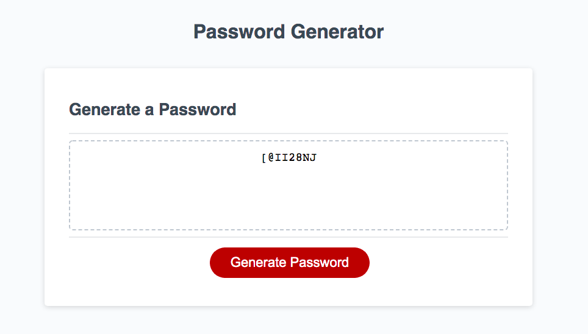

# Java-password

The purpose of this project was to create a password generator to create a strong password given user input

## Acceptance Criteria

-When the user clicks the button to generate a password, the user is prompted for password criteria including the length of the password (between 8-128 characters) and character types (lowercase, uppercase, numeric, and/or special characters) to include in the password. After all prompts are answered, a password is generated and written to the page. If the user does not answer with password length between 8-128, the user is re-prompted. If the user does not accept at least one character type, they are alerted to select at least one option. 

## Site Preview

## Link

